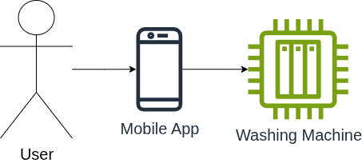

<div align="center">
  <h1>Smart Washing Machine Android App</h1>
  <p><h3 align="center">Machine Controller App with Flutter 🚀</h3></p>
</div>

[Hardware Design](https://github.com/HuzaifaIrfan-IoT/smart-washing-machine)
&nbsp;&nbsp;•&nbsp;&nbsp;
[ESP8266 Controller Firmware](https://github.com/HuzaifaIrfan-Firmware/smart-washing-machine-esp8266)

<hr />

v1.2 Updated on 2026-06-29

<hr>

## 🎬 Demo

[▶️](https://www.youtube.com/watch?v=0KOfMb7EBvc)

## Features
- [x] Save ESP8266 Hostname to Connect
- [x] Save Default Tasks Countdown
- [x] Restart Controller Button
- [x] Connected Status
- [x] Current countdown, sequence index,  task, running + hold status, Lid Closed State
- [x] Run / Pause Button for Current Task
- [x] Hold / Skip Button for Current Task
- [x] Refresh Controller Status and Reset to Task Sequence 0 Button
- [x] Manually Set Next Task
- [x] Add and Set Tasks Sequence to run Fully Automatically on the Controller


# 🚀 Usage

## Operation



- Power on the Machine
- Open the "Washing Machine” App on your Mobile Phone
- Open Settings Icon
- Set Static IP Address of Wwashing Machine and last octet of IP
- Save and Back
- Open Presets to change if required
- Run Preset and Go Back
- Refresh to Check Task Sequence sent to Washing Machine
- Start the Machine

> [!WARNING]
> - Always Set Drain Task Before and After Dry Task
> - Close the Lid for Dry Task to run or it will be paused on Dry Task


# 🛠️ Development

## Install Lib

```bash
flutter pub get
```

## Check Flutter Devices
```bash
flutter devices
```

## Run

```bash
flutter run --release
```

## Build APK

```bash
flutter build apk
```


# 📝 Documentation

# 📚 References


# 🤝🏻 Connect with Me

## Huzaifa Irfan

- 💬 Just want to say hi?
- 🚀 Have a project to discuss?
- 📧 Email me @: [hi@huzaifairfan.com](mailto:hi@huzaifairfan.com)
- 📞 Visit my Profile for other channels:

[](https://github.com/HuzaifaIrfan/)
[](https://www.huzaifairfan.com)

# 📜 License

Licensed under the GPL3 License, Copyright 2025 Huzaifa Irfan. [LICENSE](LICENSE)

