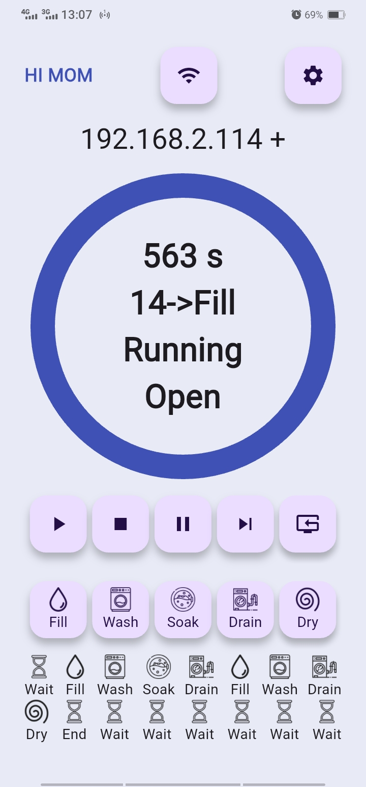

<div align="center">
  <h1>Smart Washing Machine Android App</h1>
  <p><h3 align="center">Machine Controller App with Flutter 🚀</h3></p>
</div>

[Hardware Design](https://github.com/HuzaifaIrfan-IoT/smart-washing-machine)
&nbsp;&nbsp;•&nbsp;&nbsp;
[ESP8266 Controller Firmware](https://github.com/HuzaifaIrfan-Firmware/smart-washing-machine-esp8266)


<hr>

## Features
- [x] Save ESP8266 Hostname to Connect
- [x] Save Default Tasks Countdown
- [x] Restart Controller Button
- [x] Connected Status
- [x] Current countdown, sequence index,  task, running + hold status, Lid Closed State
- [x] Run / Pause Button for Current Task
- [x] Hold / Skip Button for Current Task
- [x] Refresh Controller Status and Reset to Task Sequence 0 Button
- [x] Manually Set Next Task
  - [ ] Manually Set Countdown in UI
- [ ] Add and Set Tasks Sequence to run Fully Automatically on the Controller


## App Demo Video

[](https://www.youtube.com/shorts/Oas83ZrqOdc)

# 🚀 Usage

## Install

```bash
flutter pub get
```

## Run

```bash
flutter run
```

## Operation


- Power on the Machine
- Open the “Smart Washing Machine” App on your Mobile Phone

# 📝 Documentation

# 📚 References


# 🤝🏻 Connect with Me

[](https://github.com/HuzaifaIrfan/)
[](https://www.huzaifairfan.com)

# 📜 License

Licensed under the GPL3 License, Copyright 2025 Huzaifa Irfan. [LICENSE](LICENSE)

